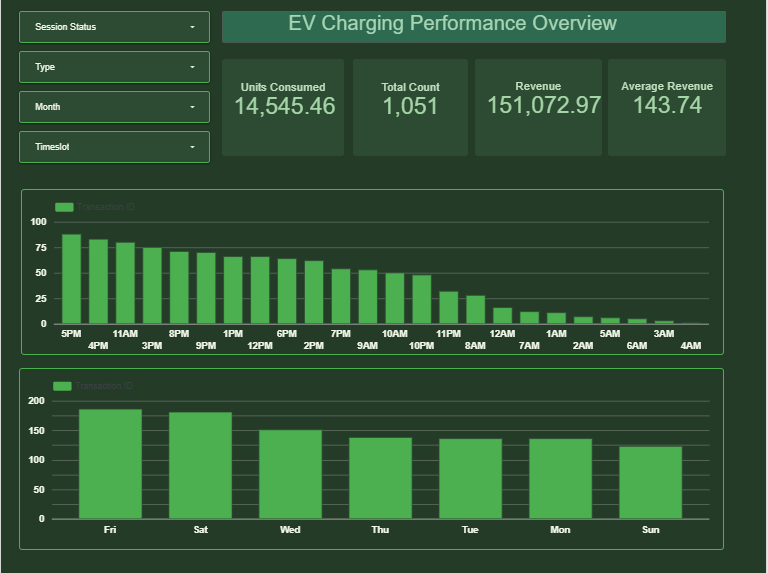

# ⚡ EV Charging Performance Analysis

## 📌 Project Overview

This project analyzes EV (Electric Vehicle) charging session data to uncover 
performance trends across time slots, days of the week, session types, and 
statuses. The goal is to help EV charging station operators understand usage 
patterns, optimize revenue, and improve session management.

---

## 🛠️ Tools Used

| Tool | Purpose |
|------|---------|
| **Looker Studio** | Interactive dashboard & visualizations |
| **Google Sheets** | Data storage & preparation |

---

## 📊 Key Metrics (All Sessions)

| Metric | Value |
|--------|-------|
| ⚡ Total Units Consumed | 14,545.46 kWh |
| 🔢 Total Charging Sessions | 1,051 |
| 💰 Total Revenue | ₹1,51,072.97 |
| 📈 Average Revenue per Session | ₹143.74 |

---

## 💡 Key Insights

### 🕐 Peak Charging Hours
- Evening hours (4PM–5PM) see the highest number of sessions
- Session count gradually declines through the night, lowest between 3AM–4AM
- Operators could offer off-peak discounts late night to balance load

### 📅 Day of Week Trends
- Friday and Saturday are the busiest days for EV charging
- Sunday records the lowest session count
- Weekend demand suggests personal vehicle and leisure travel usage

### 📌 Dashboard Filters
- Session Status
- Charger Type
- Month
- Timeslot

---

## 🎯 Business Recommendations

1. Increase charger availability during 4PM–9PM peak window
2. Offer loyalty pricing for weekday users (Mon–Thu) to boost low-traffic days
3. Investigate failed sessions — reducing failures directly improves revenue
4. Night-time promotions (12AM–6AM) could attract fleet operators

---

## 📁 Repository Structure
